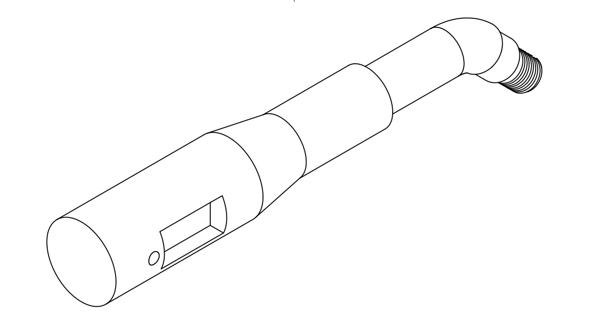
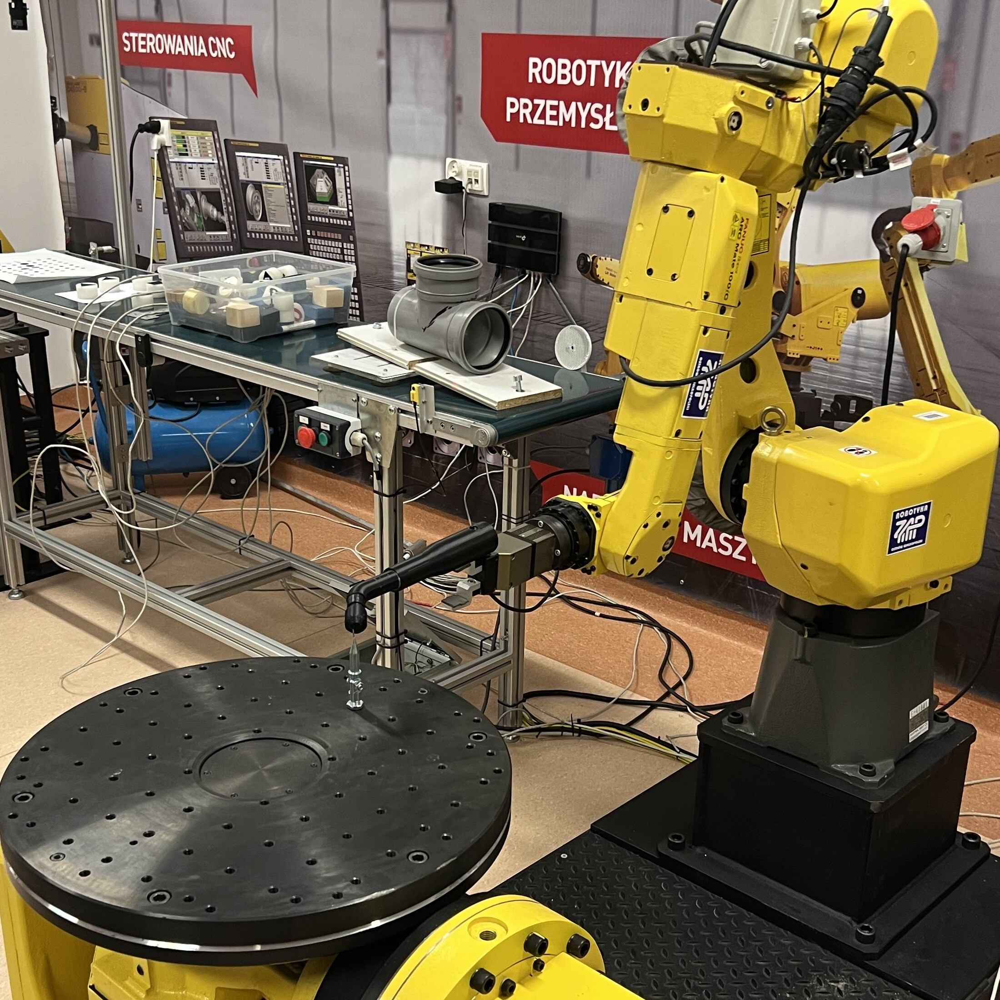
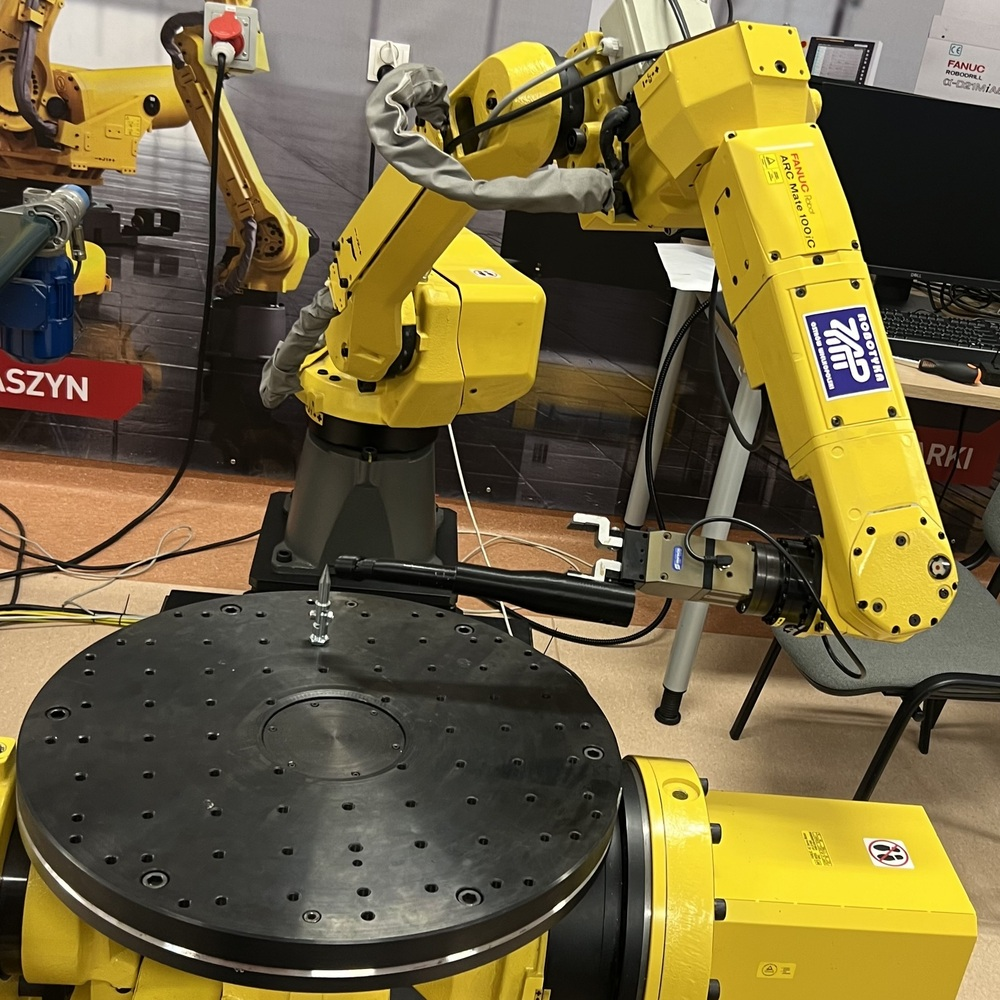
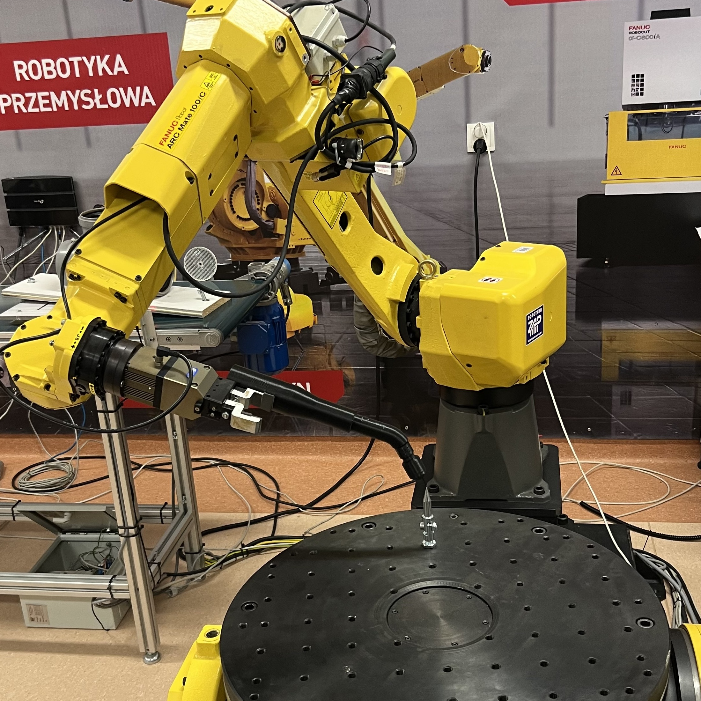
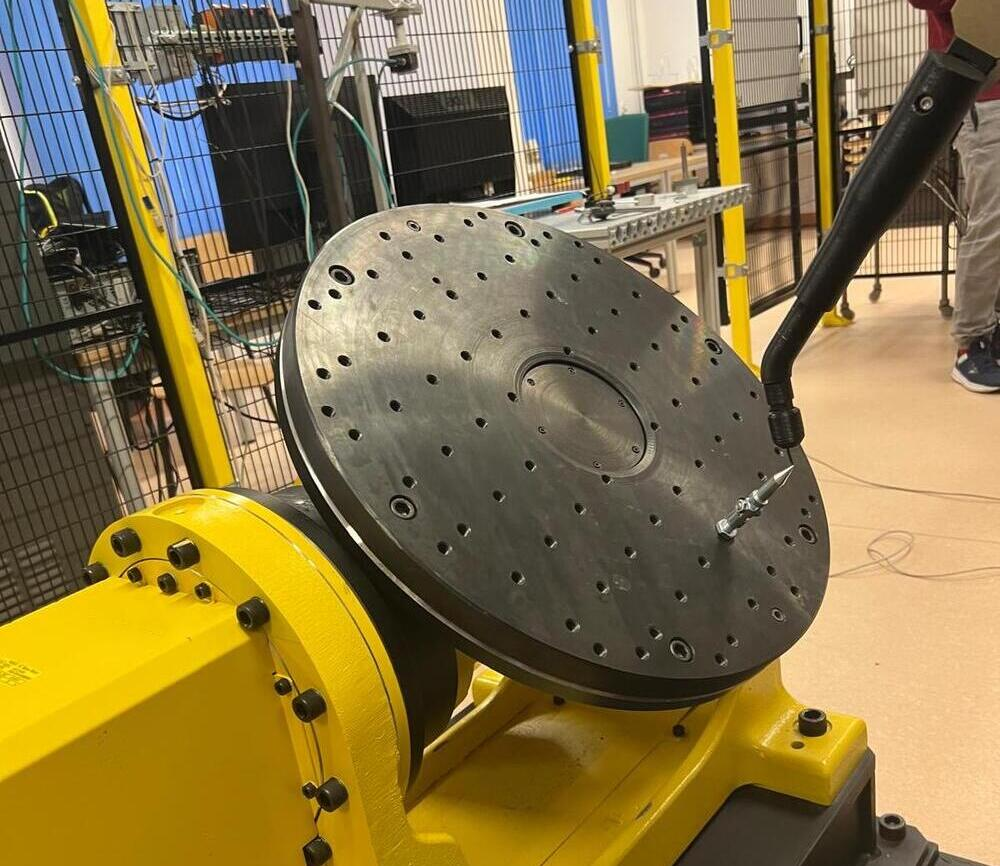
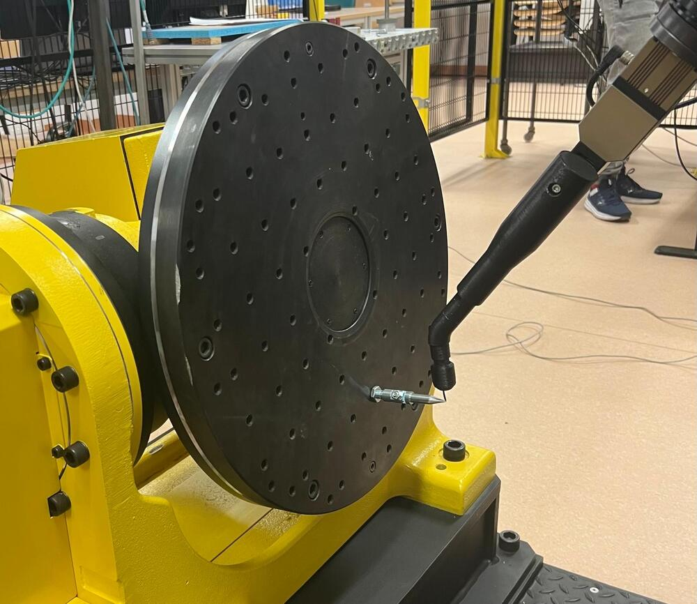

## Bachelor's thesis - "Usage example of 2-axis positioner during the welding process"

Project demonstrates how the welding process can be robotized in the industry using *FANUC ArcMate 100iC* robot. The most important parts that have been done are mentioned below.

### Designing and printing the welding torch
Project is focused on calibrating and programming robotic arm and positioner rather than welding process itself. That is why a welding torch was designed, which is essential tool in all calibration stages. It was printed in four independent parts, then built up from them to create complete welding torch.<br>
<br>
More images and 3D visualizations are available in `welding-torch` directiory.
### Calibrating components of the workstation
1. Tool coordinate system (tool calibration)<br>

   &nbsp;&nbsp;
   &nbsp;&nbsp;
   
2. Coordinated motion

   &nbsp;&nbsp;
   &nbsp;&nbsp;
### Writing programs using FANUC TP language
1. tp_welding
<div style="width: 50%; max-height: 250px; overflow-y: auto;">
```tp
 1:J PR[1] 100% FINE ;
 2:J PR[2] 40% FINE
  :  Arc Start[1] ;
 3:C P[3] 
  :  P[2] WELD_SPEED FINE COORD ;
 4:C P[4] 
  :  P[5] WELD_SPEED FINE COORD ;
 5:C P[6] 
  :  P[7] WELD_SPEED FINE COORD ;
 6:C P[8] 
  :  P[9] WELD_SPEED FINE COORD ;
 7:L P[10] 500mm/sec FINE
  :  Arc End[1] ;
 8:J PR[1] 100% FINE ;
```
</div>
2. tp_weave

<details>
<summary><b>Rozwiń program (TP)</b></summary>

```tp
 1:J PR[1] 100% FINE ;
 2:  Weave L[1] ;
 3:J PR[2] 40% FINE
  :  Arc Start[1] ;
 4:L P[11] WELD_SPEED FINE COORD ;
 5:  Weave L[2] ;
 6:C P[3] 
  :  P[2] WELD_SPEED FINE COORD ;
 7:L P[12] WELD_SPEED FINE COORD ;
 8:  Weave L[1] ;
 9:C P[4] 
  :  P[5] WELD_SPEED FINE COORD ;
10:L P[15] 2000mm/sec FINE ;
11:L P[13] WELD_SPEED FINE COORD ;
12:  Weave L[2] ;
13:C P[6] 
  :  P[7] WELD_SPEED FINE COORD ;
14:L P[14] WELD_SPEED FINE COORD ;
15:  Weave L[1] ;
16:C P[8] 
  :  P[9] WELD_SPEED FINE COORD ;
17:  Weave End ;
18:L P[10] 500mm/sec FINE
  :  Arc End[1] ;
19:J PR[1] 100% FINE ;


